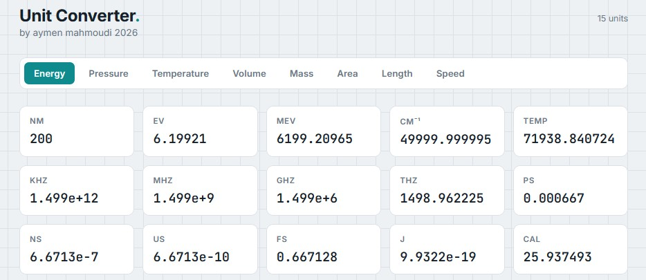

# Unit converter

## Description
A simple interactive web-based tool for converting between various units of measurement. 

## Usage
Open the Converter tool by following this link: [https://aymen-mahmoudi.github.io/Unit-converter/](https://aymen-mahmoudi.github.io/Unit-converter/) or run the index file locally.

## Features
- Supports multiple unit categories
- imple and intuitive interface.
- Mobile-friendly design for use on any device.

## Support and Contributing
If you have any suggestions or ideas to improve the Unit Converter, feel free to share them. Your feedback is highly appreciated.
  
In case of any issues, please post them in the issue tracker. 

